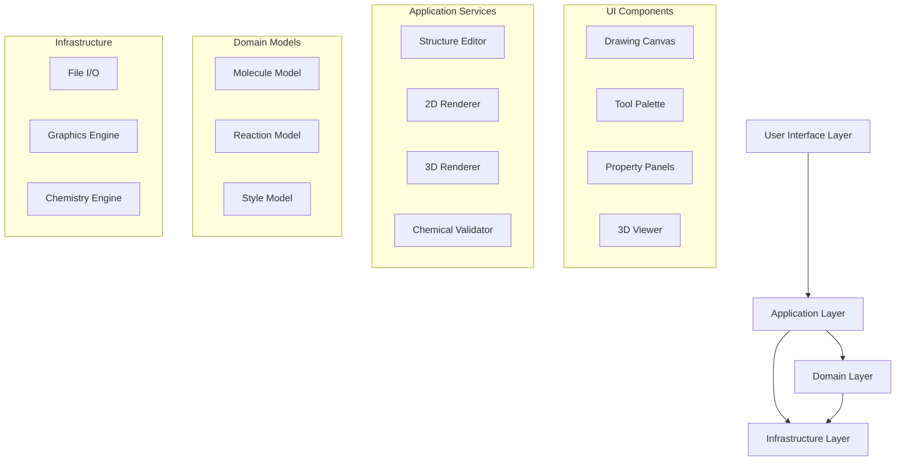

# Design Document: Chemical Reaction Drawer

## Overview

The Chemical Reaction Drawer is a desktop application that provides comprehensive chemical structure drawing and 3D visualization capabilities. The application follows a modular architecture with clear separation between the rendering engine, chemical intelligence system, and user interface components. The design emphasizes performance, extensibility, and chemical accuracy while providing an intuitive user experience comparable to professional chemical drawing software.

## Architecture

### High-Level Architecture

The application follows a layered architecture with the following primary layers:

1. **Presentation Layer**: Desktop GUI components 
The application uses a Model-View-Controller (MVC) architectural pattern with specialized components for chemical structure representation, 3D molecular visualization, and advanced styling capabilities. The core architecture supports both 2D chemical drawing and 3D molecular modeling within a unified interface.
and user interaction handling
2. **Application Layer**: Business logic and workflow coordination
3. **Domain Layer**: Chemical structure models and validation logic  
4. **Infrastructure Layer**: File I/O, rendering engines, and external integrations



### Component Architecture

The application is organized into several key subsystems:

- **Chemical Structure Engine**: Core molecular representation and manipulation
- **Rendering System**: 2D and 3D graphics rendering with styling support
- **User Interface Framework**: Desktop GUI with specialized chemical drawing tools
- **File Management System**: Import/export capabilities for multiple chemical formats
- **Validation Engine**: Chemical intelligence and structure validation

## Components and Interfaces

### Core Components

#### 1. Chemical Structure Engine

**Purpose**: Manages the internal representation of chemical structures and provides manipulation operations.

**Key Classes**:
- `Molecule`: Represents a complete molecular structure with atoms and bonds
- `Atom`: Individual atomic elements with properties (element type, charge, coordinates)
- `Bond`: Connections between atoms with bond order and stereochemistry
- `Reaction`: Collection of reactants, products, and reaction conditions

**Interfaces**:
```
interface IChemicalStructure {
    addAtom(element: string, position: Point2D): Atom
    addBond(atom1: Atom, atom2: Atom, bondType: BondType): Bond
    removeAtom(atom: Atom): void
    removeBond(bond: Bond): void
    validateStructure(): ValidationResult
    calculateProperties(): MolecularProperties
}
```

#### 2. 3D Visualization Engine

**Purpose**: Handles three-dimensional molecular rendering and user interaction in 3D space.

**Key Classes**:
- `Molecule3D`: 3D representation with spatial coordinates
- `Renderer3D`: OpenGL-based 3D rendering engine
- `Camera3D`: 3D viewport and navigation controls
- `GeometryOptimizer`: Converts 2D structures to 3D conformations

**Interfaces**:
```
interface I3DRenderer {
    renderMolecule(molecule: Molecule3D): void
    setCamera(position: Vector3D, target: Vector3D): void
    handleRotation(deltaX: number, deltaY: number): void
    handleZoom(zoomFactor: number): void
    exportImage(format: ImageFormat): ImageData
}
```

#### 3. Drawing Canvas System

**Purpose**: Provides the main drawing interface with tool handling and user interaction.

**Key Classes**:
- `DrawingCanvas`: Main drawing surface with event handling
- `ToolManager`: Manages drawing tools and their behaviors
- `SelectionManager`: Handles object selection and manipulation
- `UndoRedoManager`: Command pattern implementation for undo/redo

**Interfaces**:
```
interface IDrawingCanvas {
    setTool(tool: DrawingTool): void
    handleMouseEvent(event: MouseEvent): void
    addStructure(structure: IChemicalStructure): void
    getSelectedObjects(): DrawableObject[]
    undo(): void
    redo(): void
}
```

#### 4. Styling System

**Purpose**: Manages visual appearance including fonts, colors, line styles, and themes.

**Key Classes**:
- `StyleManager`: Central styling coordination
- `ColorPalette`: Color scheme management
- `FontManager`: Typography and text rendering
- `ThemeEngine`: Predefined visual themes

**Interfaces**:
```
interface IStyleManager {
    applyStyle(objects: DrawableObject[], style: Style): void
    createColorPalette(colors: Color[]): ColorPalette
    setFont(fontFamily: string, size: number): void
    loadTheme(theme: Theme): void
    saveCustomTheme(theme: Theme): void
}
```

#### 5. File I/O System

**Purpose**: Handles import and export of chemical structures in various formats.

**Key Classes**:
- `FileManager`: Coordinates file operations
- `FormatRegistry`: Manages supported file formats
- `MolFileParser`: MDL MOL file format support
- `CDXParser`: ChemDraw format support
- `ImageExporter`: Graphics export functionality

**Interfaces**:
```
interface IFileManager {
    saveFile(structure: IChemicalStructure, format: FileFormat): boolean
    loadFile(filePath: string): IChemicalStructure
    exportImage(structure: IChemicalStructure, format: ImageFormat): ImageData
    getSupportedFormats(): FileFormat[]
}
```

### Data Models

#### Molecular Structure Model

The core data model represents chemical structures as graphs where atoms are nodes and bonds are edges:

```
class Molecule {
    atoms: Atom[]
    bonds: Bond[]
    properties: MolecularProperties
    
    addAtom(atom: Atom): void
    removeBond(bond: Bond): void
    calculateMolecularFormula(): string
    validate(): ValidationResult
}

class Atom {
    element: ChemicalElement
    position: Point2D
    position3D: Point3D
    charge: number
    hydrogenCount: number
    bonds: Bond[]
}

class Bond {
    atom1: Atom
    atom2: Atom
    bondOrder: BondOrder
    stereochemistry: Stereochemistry
    style: BondStyle
}
```

#### Reaction Model

Chemical reactions are represented as collections of molecular structures with reaction metadata:

```
class Reaction {
    reactants: Molecule[]
    products: Molecule[]
    catalysts: Molecule[]
    conditions: ReactionConditions
    arrows: ReactionArrow[]
    
    addReactant(molecule: Molecule): void
    addProduct(molecule: Molecule): void
    setConditions(conditions: ReactionConditions): void
}
```

#### Style Model

Visual styling is managed through a hierarchical style system:

```
class Style {
    fontFamily: string
    fontSize: number
    color: Color
    lineWidth: number
    fillColor: Color
    transparency: number
    
    apply(drawable: DrawableObject): void
    merge(otherStyle: Style): Style
}
```
## Data Models

### Chemical Intelligence System

The application includes a chemical intelligence system that provides validation and assistance:

```
class ChemicalValidator {
    validateValency(atom: Atom): ValidationResult
    suggestCorrections(molecule: Molecule): Correction[]
    calculateProperties(molecule: Molecule): MolecularProperties
    detectAromaticity(ring: Ring): boolean
}

class MolecularProperties {
    molecularWeight: number
    molecularFormula: string
    logP: number
    polarSurfaceArea: number
    hydrogenBondDonors: number
    hydrogenBondAcceptors: number
}
```

### Template System

Pre-built chemical structures are managed through a template system:

```
class TemplateLibrary {
    categories: TemplateCategory[]
    searchIndex: SearchIndex
    
    getTemplatesByCategory(category: string): Template[]
    searchTemplates(query: string): Template[]
    addCustomTemplate(template: Template): void
}

class Template {
    name: string
    structure: Molecule
    category: string
    keywords: string[]
    thumbnail: ImageData
}
```

### 3D Geometry System

Three-dimensional molecular representation uses spatial coordinates and conformational analysis:

```
class Molecule3D extends Molecule {
    conformations: Conformation[]
    activeConformation: number
    
    generateConformation(): Conformation
    optimizeGeometry(): void
    calculateSurfaceArea(): number
}

class Conformation {
    atomPositions: Point3D[]
    energy: number
    
    calculateRMSD(other: Conformation): number
    applyTransformation(matrix: Matrix4x4): void
}
```

Now I need to use the prework tool to analyze the acceptance criteria before writing the Correctness Properties section:

<function_calls>
<invoke name="prework">
<parameter name="featureName">chemical-reaction-drawer

## Data Models

### Chemical Intelligence System

The application includes a chemical intelligence system that provides validation and assistance:

```
class ChemicalValidator {
    validateValency(atom: Atom): ValidationResult
    suggestCorrections(molecule: Molecule): Correction[]
    calculateProperties(molecule: Molecule): MolecularProperties
    detectAromaticity(ring: Ring): boolean
}

class MolecularProperties {
    molecularWeight: number
    molecularFormula: string
    logP: number
    polarSurfaceArea: number
    hydrogenBondDonors: number
    hydrogenBondAcceptors: number
}
```

### Template System

Pre-built chemical structures are managed through a template system:

```
class TemplateLibrary {
    categories: TemplateCategory[]
    searchIndex: SearchIndex
    
    getTemplatesByCategory(category: string): Template[]
    searchTemplates(query: string): Template[]
    addCustomTemplate(template: Template): void
}

class Template {
    name: string
    structure: Molecule
    category: string
    keywords: string[]
    thumbnail: ImageData
}
```

### 3D Geometry System

Three-dimensional molecular representation uses spatial coordinates and conformational analysis:

```
class Molecule3D extends Molecule {
    conformations: Conformation[]
    activeConformation: number
    
    generateConformation(): Conformation
    optimizeGeometry(): void
    calculateSurfaceArea(): number
}

class Conformation {
    atomPositions: Point3D[]
    energy: number
    
    calculateRMSD(other: Conformation): number
    applyTransformation(matrix: Matrix4x4): void
}
```

## Correctness Properties

*A property is a characteristic or behavior that should hold true across all valid executions of a system-essentially, a formal statement about what the system should do. Properties serve as the bridge between human-readable specifications and machine-verifiable correctness guarantees.*

Based on the prework analysis, I've identified several key properties that can be consolidated to eliminate redundancy. Many of the individual acceptance criteria can be combined into more comprehensive properties that test broader system behaviors.

### Property Reflection

After reviewing all testable properties from the prework analysis, I've identified several areas where properties can be consolidated:

- Bond creation properties (1.2, 1.3, 2.1, 2.2, 2.3) can be combined into a comprehensive bond creation property
- Styling properties (5.1, 5.2, 5.3, 5.5) can be combined into a general styling application property  
- File I/O properties (7.1, 7.4) represent round-trip operations that can be combined
- UI interaction properties (8.3, 8.4, 8.5, 8.6) can be consolidated into general UI operation properties

### Core Properties

**Property 1: Atom Placement Accuracy**
*For any* canvas click position, placing an atom should result in an atom being created at that exact location with default element properties
**Validates: Requirements 1.1**

**Property 2: Bond Creation and Type Application**  
*For any* pair of atoms and any valid bond type selection, creating a bond between those atoms should result in a bond of the selected type connecting the atoms
**Validates: Requirements 1.2, 1.3, 2.1, 2.2, 2.3**

**Property 3: Element Change Consistency**
*For any* atom and any valid element symbol, changing the atom's element should update the atom to display the new element symbol and properties
**Validates: Requirements 1.4, 1.5**

**Property 4: Structure Integrity on Deletion**
*For any* molecular structure and any atom in that structure, deleting the atom should remove all associated bonds and maintain the remaining structure's chemical validity
**Validates: Requirements 1.6**

**Property 5: Aromaticity Detection and Display**
*For any* ring structure that meets aromaticity criteria, the system should automatically detect and visually represent the aromatic character appropriately
**Validates: Requirements 2.4, 2.5**

**Property 6: 2D to 3D View Consistency**
*For any* molecular structure, converting from 2D to 3D view and back should preserve the molecular connectivity and chemical identity
**Validates: Requirements 3.1, 3.6**

**Property 7: 3D Interaction Responsiveness**
*For any* 3D molecular view, rotation and zoom operations should modify the view parameters while preserving the underlying molecular structure
**Validates: Requirements 3.2, 3.3**

**Property 8: 3D Rendering Accuracy**
*For any* molecular structure in 3D view, atoms should render as appropriately sized and colored spheres, and bonds should render as cylinders connecting atomic centers
**Validates: Requirements 3.4, 3.5**

**Property 9: Reaction Component Placement**
*For any* reaction arrow or reaction component, placement on the canvas should position the component at the specified location with correct visual properties
**Validates: Requirements 4.1, 4.2, 4.3, 4.4, 4.5**

**Property 10: Styling Application Consistency**
*For any* selected objects and any style modification (font, color, line thickness, theme), applying the style should update all selected objects to reflect the new styling
**Validates: Requirements 5.1, 5.2, 5.3, 5.5**

**Property 11: Custom Palette Persistence**
*For any* custom color palette, saving and reloading the palette should preserve all color values and make them available for future use
**Validates: Requirements 5.6**

**Property 12: Template Placement Accuracy**
*For any* template selection and cursor position, placing the template should insert the complete structure at the cursor location with correct connectivity
**Validates: Requirements 6.2, 6.5**

**Property 13: Template Search Functionality**
*For any* search query in the template library, results should include only templates that match the query criteria by name or chemical properties
**Validates: Requirements 6.6**

**Property 14: File Format Round-Trip Integrity**
*For any* molecular structure, saving in the native format and reloading should produce an equivalent structure with identical connectivity and properties
**Validates: Requirements 7.1, 7.4**

**Property 15: Export Format Support**
*For any* molecular structure and any supported export format, the export operation should produce a valid file in the specified format containing the structure data
**Validates: Requirements 7.2, 7.3**

**Property 16: Import Format Compatibility**
*For any* valid chemical file in a supported format, importing should correctly parse and display the molecular structure with preserved chemical information
**Validates: Requirements 7.5**

**Property 17: 3D Coordinate Preservation**
*For any* chemical file containing 3D coordinates, importing should preserve the spatial information and make it available for 3D visualization
**Validates: Requirements 7.6**

**Property 18: Standard UI Operations**
*For any* molecular structure and any standard operation (copy, paste, undo, redo), the operation should modify the structure appropriately and maintain system state consistency
**Validates: Requirements 8.3, 8.4**

**Property 19: Keyboard Shortcut Functionality**
*For any* supported keyboard shortcut, triggering the shortcut should execute the same operation as the corresponding menu or toolbar action
**Validates: Requirements 8.5**

**Property 20: Multi-Selection Operations**
*For any* group of selected objects and any group operation (move, delete, style), the operation should apply consistently to all selected objects
**Validates: Requirements 8.6**

**Property 21: Chemical Validation Accuracy**
*For any* molecular structure, the validation system should correctly identify valency violations and provide appropriate warnings or suggestions
**Validates: Requirements 9.1, 9.2, 9.3**

**Property 22: Molecular Formula Calculation**
*For any* molecular structure, the calculated molecular formula should accurately represent the elemental composition of the structure
**Validates: Requirements 9.4**

**Property 23: Automatic Hydrogen Management**
*For any* molecular structure, hydrogen atoms should be automatically added or removed to satisfy valency requirements when atoms or bonds are modified
**Validates: Requirements 9.5**

**Property 24: Molecular Property Calculation**
*For any* molecular structure, calculated properties (molecular weight, etc.) should be chemically accurate based on the structure's composition
**Validates: Requirements 9.6**

## Error Handling

The application implements comprehensive error handling across all major subsystems:

### Chemical Structure Validation
- Invalid valency detection with user-friendly error messages
- Impossible structure warnings with suggested corrections
- Automatic recovery from common drawing mistakes

### File I/O Error Handling
- Graceful handling of corrupted or invalid chemical files
- Format detection and appropriate error messages for unsupported formats
- Backup and recovery mechanisms for unsaved work

### 3D Rendering Error Handling
- Fallback to 2D view when 3D rendering fails
- Memory management for large molecular structures
- Graphics driver compatibility checks

### User Interface Error Handling
- Undo/redo system with unlimited history
- Auto-save functionality to prevent data loss
- Graceful degradation when system resources are limited

## Testing Strategy

The testing strategy employs a dual approach combining unit tests for specific scenarios and property-based tests for comprehensive coverage:

### Property-Based Testing
- **Framework**: Use QuickCheck-style property testing library appropriate for the chosen implementation language
- **Test Configuration**: Minimum 100 iterations per property test to ensure statistical confidence
- **Coverage**: Each correctness property implemented as a separate property-based test
- **Tagging**: Each test tagged with format: **Feature: chemical-reaction-drawer, Property {number}: {property_text}**

### Unit Testing
- **Specific Examples**: Test concrete examples of chemical structures and operations
- **Edge Cases**: Test boundary conditions like empty structures, single atoms, maximum structure sizes
- **Integration Points**: Test interactions between major components (2D/3D conversion, file I/O, validation)
- **Error Conditions**: Test error handling and recovery mechanisms

### Test Data Generation
- **Chemical Structure Generators**: Create valid molecular structures with varying complexity
- **Random Element Selection**: Generate atoms using realistic element distributions
- **Bond Type Variation**: Test all supported bond types and stereochemistry options
- **File Format Testing**: Generate test files in all supported chemical formats

### Performance Testing
- **Responsiveness**: Verify UI operations complete within acceptable timeframes
- **Scalability**: Test with large molecular structures (up to 10,000 atoms)
- **Memory Usage**: Monitor memory consumption during extended use
- **3D Rendering**: Verify smooth performance in 3D visualization mode

The combination of property-based and unit testing ensures both broad coverage of the input space and detailed validation of specific chemical drawing scenarios.